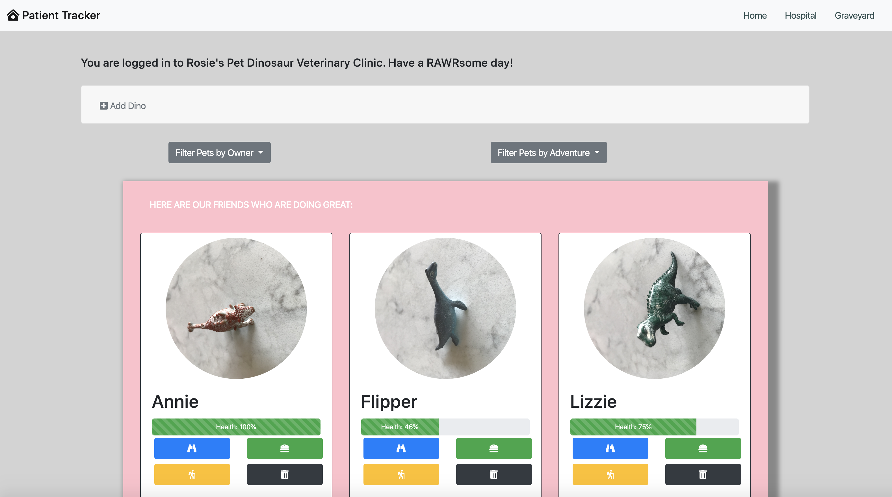
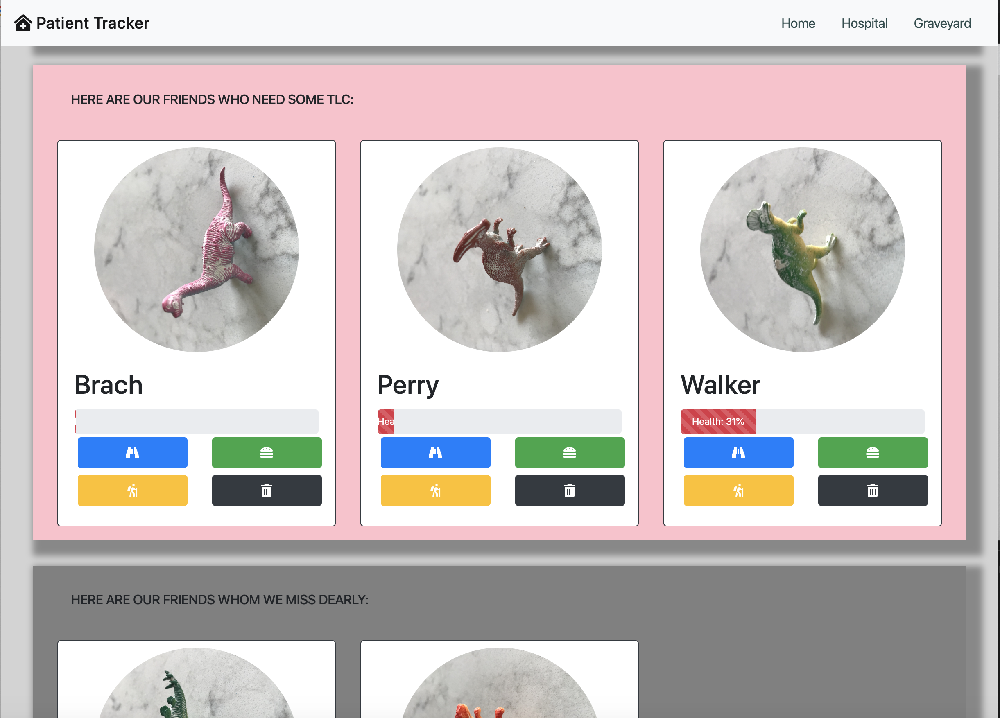
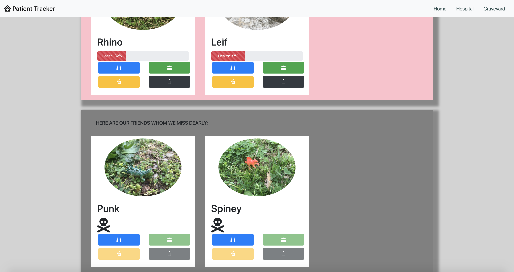

# Pet Dinosaur Vet Clinic

## Description
This application tracks patients at a pet dinosaur veterinary clinic. This project showcases all the vanilla javascript we learned in the first part of our front-end program, the Foundations milestone. 

Feature List
1. Healthy dinos get displayed in the kennel
1. Sick dinos get displayed in the hospital
1. Dead dinos get displayed in the graveyard
1. Dinos can be removed from the kennel
1. Dinos can be added to the kennel, and the user's entry data gets validated to confirm it includes the dino's name
1. Dinos can be fed, which improves their health score
1. Dinos can be petted, which improves their health score
1. Dinos can be sent on an adventure, which decreases their health score
1. Users can filter the list of dinos by owner and the adventures the dinsoaurs have been on
1. Users can see an individual dino's profile, which includes additional details such as his or her adventures

## Screenshots
##### Home Page

##### Hospital Section

##### Graveyard Section

## How to Run
1. Clone down this repo.
1. Make sure you have http-server installed via npm. If not, get it [here](https://www.npmjs.com/package/http-server).
1. On your command line, run `hs -p 9999`.
1. In your browser, navigate to `http://localhost:9999`.

