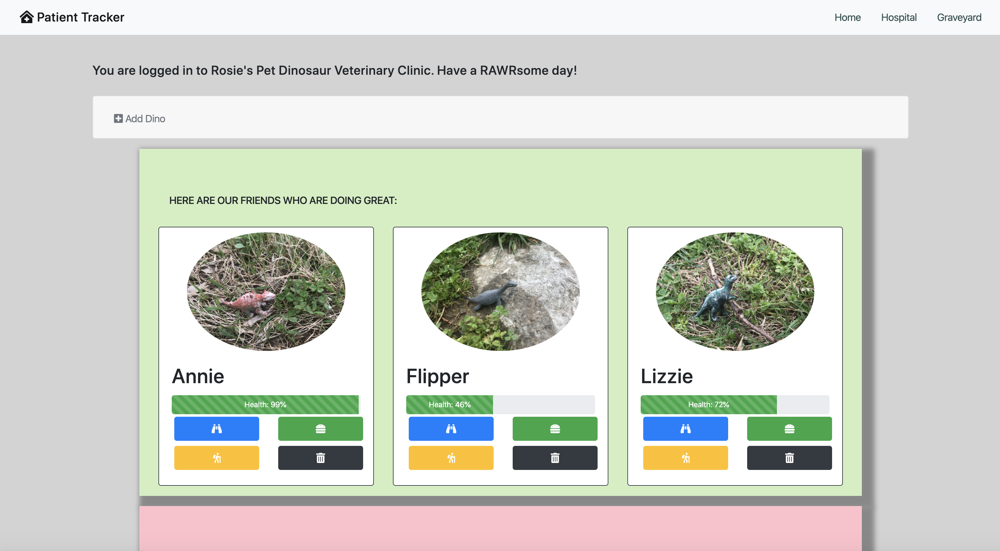
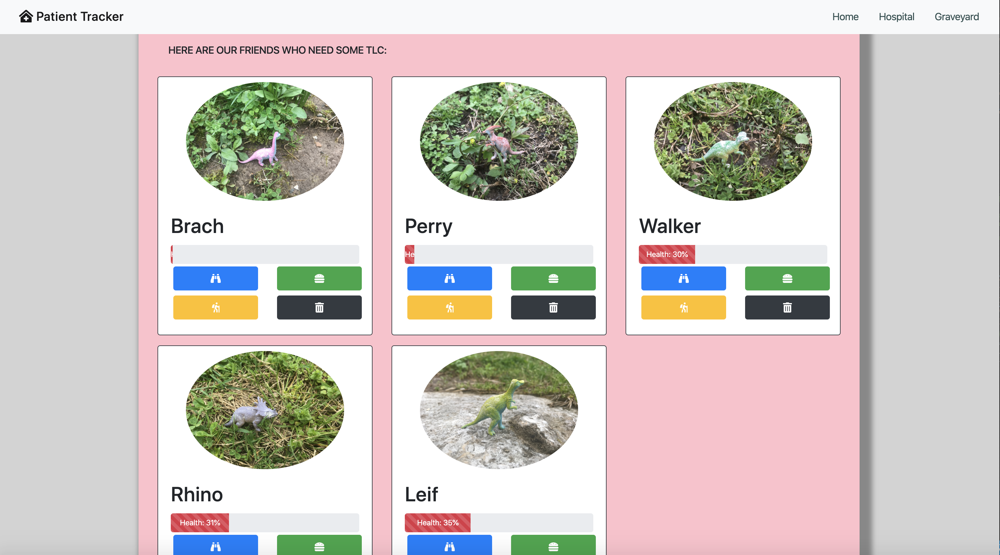
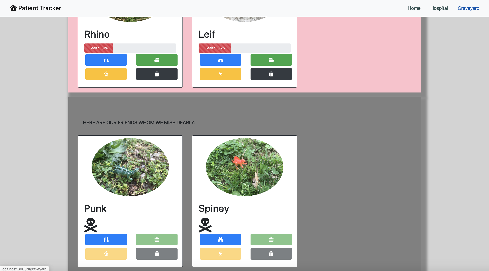
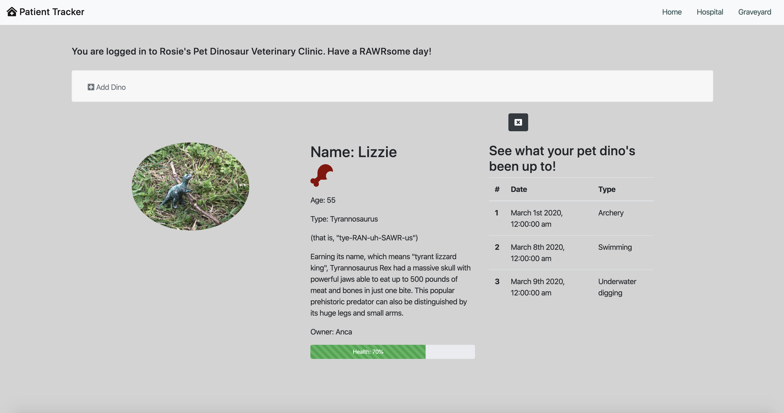
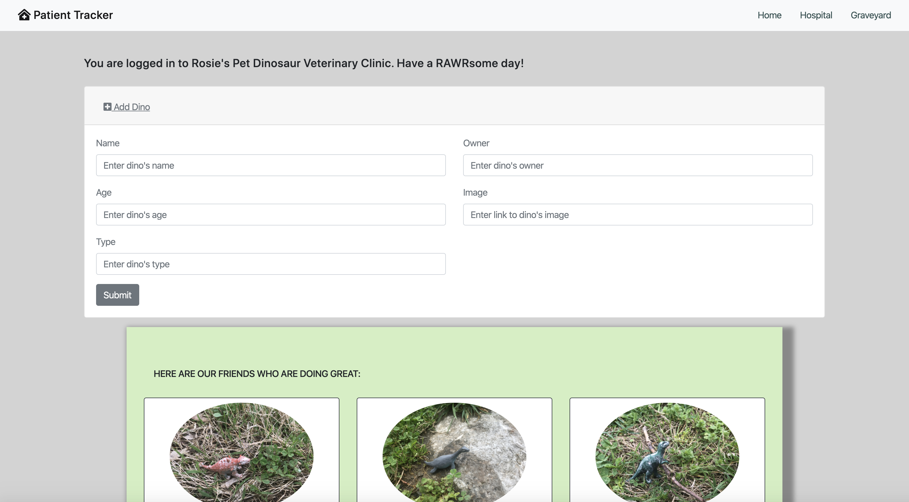
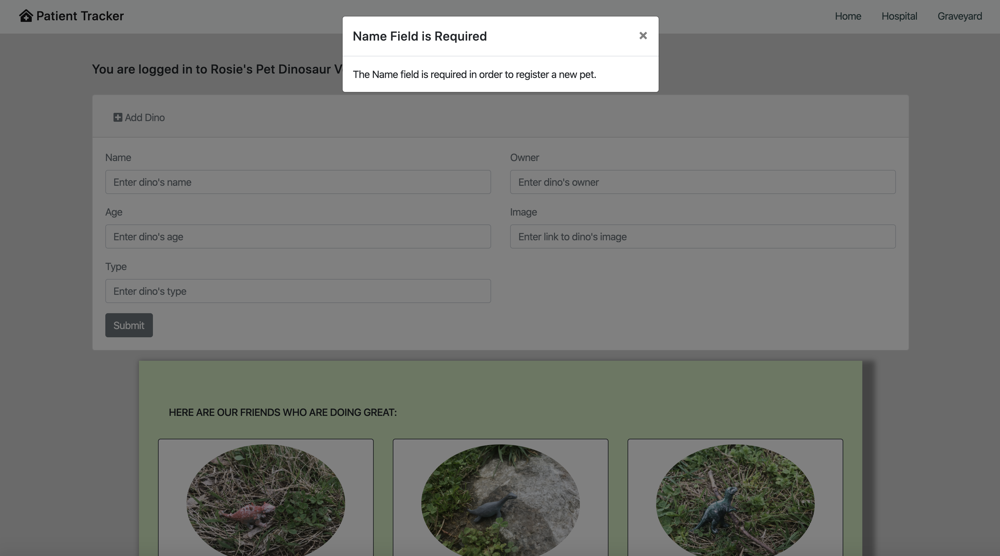

# Patient Tracker

## Description
This application tracks patients at a pet dinosaur veterinary clinic. This project showcases the Vanilla Javascript and additional tools we learned during the first part, the Foundations milestone, in our front-end bootcamp program at the Nashville Software School.

## Background
* It was exciting to combine all the new technologies and tools we had learned about in the first part of our front-end program at NSS as we were working on this project. 
* We outlined the project features as a group in class to make sure it included all the Vanilla Javascript we had learned during the Foundations milestone. We worked on a lot of the project together as a group. I made the following additional changes afterwards:
1. Added validation for the Name field in the Dino entry form. 
1. Made sure the disabled buttons worked (or rather did not work) as expected. 
1. Added more details, such as diet and type to the single view for a selected dinosaur. 
* This project helped solidify my knowledge of several tools and technologies: 
1. HTML5 in general
1. CSS and Bootstrap tools specifically (in particular, Flexbox for organizing content, the accordion component for accessing data inputs, modals for prompting the user with alerts about data required in the form inputs, forms and their own quirks - such as preventing the default behavior of a form upon submission, progress bars and displaying the data that controls them)
1. New coding requirements, such as creating new objects, calling arrays within arrays, and applying event listeners
1. Using additional Javascript methods such as .findIndex, .filter, .reset for a form and Math.random
1. Starting to use jQuery library
1. Using FontAwesome to make logo and button icons more visually appealing
1. Using Google photos to ensure my personal images would get displayed correctly
* When our amaZing instructor Zoe Ames suggested a dino kennel as the theme for this review project, I chuckled - dinosaurs were following me from the playroom into the classroom and my office! As a kid, I relished the visits my mom took us on to see the dinosaur skeletons and skeleton replicas at the Antipa National Museum of Natural History in Bucharest - but that was the extent of my fascination with dinosaurs. There was not an abundance of dinosaur toys or other paraphernalia to enjoy at that time. So when my daughter started (literally and figuratively) digging dinosaurs, I was as excited as the next 5-year old. That is why you now get to enjoy some of the dinosaurs in the Simon Dino Kennel right here on this site!

## Feature List
1. Healthy dinos get displayed in the kennel.
1. Sick dinos get displayed in the hospital.
1. Dead dinos get displayed in the graveyard.
1. Dinos can be deleted from the kennel and the hospital.
1. Dinos can be added to the kennel, and the user's entry data gets validated to confirm it includes the dino's name.
1. Dinos can be fed, which improves their health score.
1. Dinos can be petted by moving the emouse over their picture, which improves their health score.
1. Dinos can be sent on an adventure, which decreases their health score.
1. Dead dinos cannot be petted, fed, or deleted.
1. Users can view more details about a single dino, such as diet, type, age, owner, and a history of their adventures.

## Screenshots
##### Home Page

##### Hospital Section

##### Graveyard Section

##### Single Dino View

##### Adding a Dino

##### Validating New Dino's Name

## Technologies & Tools
Bootstrap, CSS, Github (for version control), HTML, Javascript, jQuery

## How to Run
1. Clone down this repo.
1. Make sure you have http-server installed via npm. If not, get it [here](https://www.npmjs.com/package/http-server).
1. On your command line, run `hs -p 9999`.
1. In your browser, navigate to `http://localhost:9999`.

