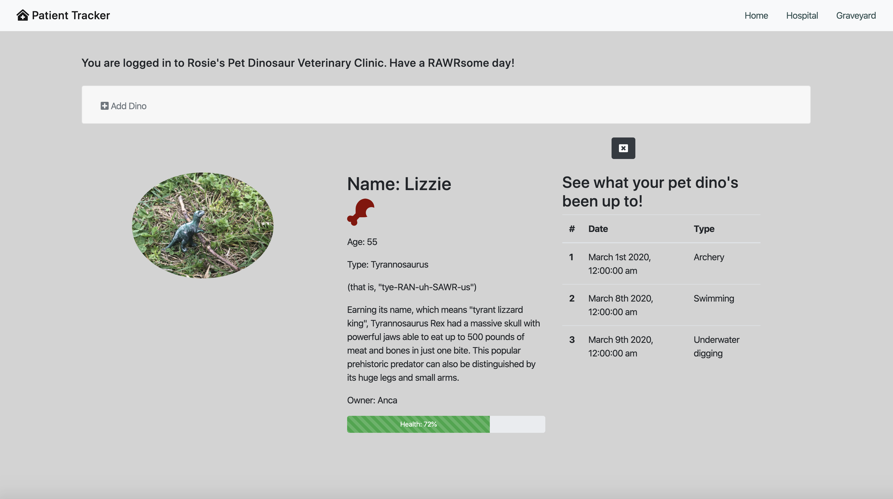

# Patient Tracker

## Description
This application tracks patients at a pet dinosaur veterinary clinic. This project showcases the vanilla javascript we learned in the first part of our front-end program at the Nashville Software School, the Foundations milestone. 

## Background
It was exciting to combine all the new technologies and tools we had learned about in the first part of our front-end program at NSS as we were working on this project. It helped solidify my knowledge of HTML and CSS, Bootstrap - and in particular how to use flexbox, as well as vanilla javascript. 

When our amaZing instructor Zoe Ames suggested a dino kennel as the theme for this review project, I chuckled - dinosaurs were following me from the playroom into the classroom and my office! As a kid, I relished the visits my mom took us on to see the dinosaur skeletons and skeleton replicas at the Grigore Antipa National Museum of Natural History in Bucharest - but that was the extent of my fascination with dinosaurs. There was not an abundance of dinosaur toys or other paraphernalia to enjoy at that time. So when my daughter started (literally and figuratively) digging dinosaurs, I was as excited as the next 5-year old. That is why you now get to enjoy some of the dinosaurs in the Simon Dino Kennel right here on this site!

## Feature List
1. Healthy dinos get displayed in the kennel.
1. Sick dinos get displayed in the hospital.
1. Dead dinos get displayed in the graveyard.
1. Dinos can be deleted from the kennel and the hospital.
1. Dinos can be added to the kennel, and the user's entry data gets validated to confirm it includes the dino's name.
1. Dinos can be fed, which improves their health score.
1. Dinos can be petted by moving the emouse over their picture, which improves their health score.
1. Dinos can be sent on an adventure, which decreases their health score.
1. Dead dinos cannot be petted, fed, or deleted.
1. Users can view more details about a single dino, such as diet, type, age, owner, and a history of their adventures.

## Screenshots
##### Home Page

##### Hospital Section

##### Graveyard Section

##### Single Dino View

##### Adding a Dino

##### Validating New Dino's Name

## Technologies & Tools
Bootstrap, CSS, Github (for version control), HTML, Javascript (vanilla)

## How to Run
1. Clone down this repo.
1. Make sure you have http-server installed via npm. If not, get it [here](https://www.npmjs.com/package/http-server).
1. On your command line, run `hs -p 9999`.
1. In your browser, navigate to `http://localhost:9999`.

